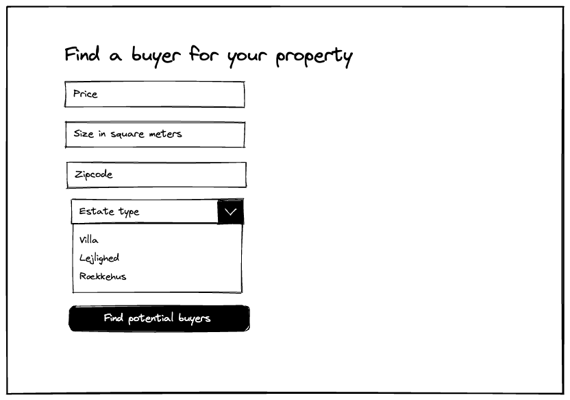
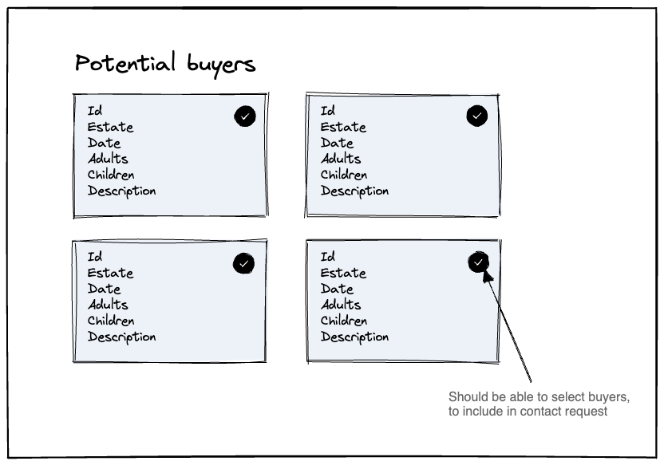
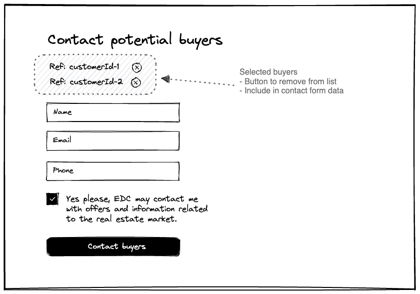
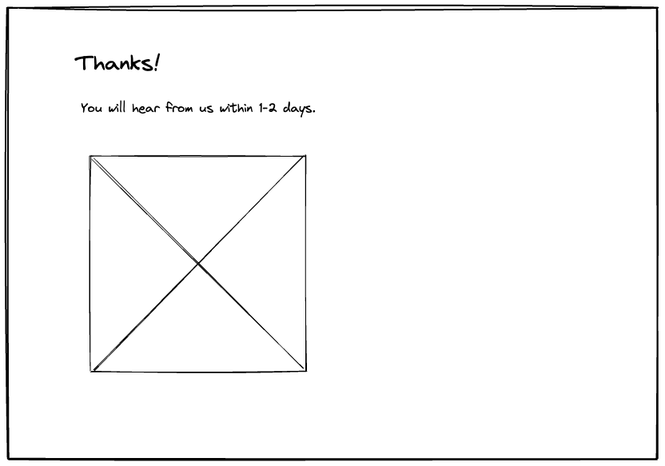
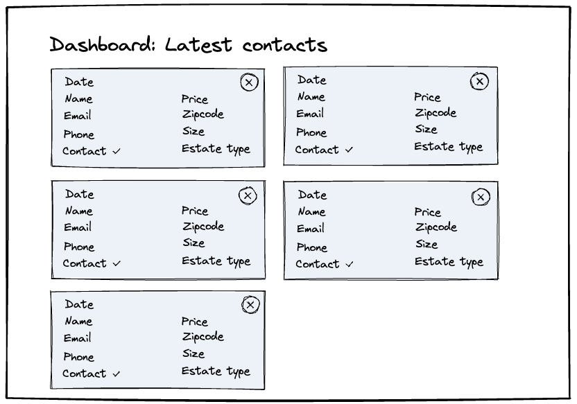

# MMD Case | EDC - Find Buyers

Selling a property is a complex process, and EDC wants to make the process as
easy as possible for their clients.

## Getting Started

To get started, you can make a copy of this project, and deploy it directly to
Vercel, with the "Deploy button" below:

[](https://vercel.com/new/clone?repository-url=https%3A%2F%2Fgithub.com%2Fcharlie-tango%2Fmmd-case&project-name=charlie-tango-case&repository-name=charlie-tango-case)

Afterward, install the dependencies on your local machine:

```bash
npm install
```

Then run the development server:

```bash
npm run dev
```

Open [http://localhost:3000](http://localhost:3000) with your browser to see the
result.

## The task

The goal of this case is to help people who are thinking of selling their
property (the seller) to get an idea of the market before they work with a real
estate agent. This will help them understand the value of their property and the
potential buyers in their area before beginning the process or engaging with an
agent. If they find a potential buyer, EDC can start the process of contacting
them and helping them sell their property.

### Functional Requirements

- Design and implement a Next.js application, that allows users to find
  potential buyers for their real estate property, and submit their details to
  EDC.
- An [API route](https://nextjs.org/docs/api-routes/introduction), function,
  service, page, or a
  [`getServerSideProps`](https://nextjs.org/docs/basic-features/data-fetching/get-server-side-props)
  function, that returns a list of potential buyers, based on the zip code, and
  other details, entered by the user.
  - See `./src/data/buyerProfiles.js` for mock data.
- An [API route](https://nextjs.org/docs/api-routes/introduction) or a request
  that posts the user's details to a
  [Supabase database](https://supabase.com/docs/guides/getting-started/quickstarts/nextjs)
- A dashboard page that displays the latest requests, from the
  [Supabase database](https://supabase.com/docs/guides/getting-started/quickstarts/nextjs).

### Pages

#### Find Buyers

You can combine these screens into a single page, or split them up into multiple
depending on your design. The important thing is that the user can complete the
4 steps in an intuitive way.

##### Landing screen

Prompt the user to enter a few details about the property they want to sell.
Submitting the form, should send the user to the next page.



##### Results screen

Display a list of potential buyers, based on the zip code, and other details,
entered by the user.



##### Contact screen

Allow the user to fill in their contact details, so EDC can contact the
potential buyers on their behalf.



##### Confirmation screen

Let the user know that their request was received successfully, and EDC will
contact them shortly.



#### Employee Dashboard

The dashboard is intended to be used by EDC employees, to view the latest
requests. For this task, it doesn't need to be secured with login. It should
fetch the latest requests from the Supabase database, and display them in a
list. It should present the relevant details from each request, to allow the EDC
employee to take action.

- It should be located at `/dashboard`.
- Email and phone should be displayed as links, so the employee can click to
  call or email the user.
- The list should be sorted by the date the request was created, with the most
  recent requests at the top.
- You should be able to delete a request from the list, by clicking a delete
  button.



## Data

You are going to be working with the following sets of data.

### Lookup details

To start with, the user should enter a few details about the property they want
to sell, so we can find relevant buyers. Ideally we want the full address, but
for this task you can decide to just get the `zip` code.

- See `./src/pages/api/find-buyers.js` for a simple example.

Relevant entries to filter potential buyers

| Field        | Type     | Description                                                                        |
| ------------ | -------- | ---------------------------------------------------------------------------------- |
| `price`      | `number` | The price the person is willing to pay for the property                            |
| `estateType` | `string` | The id of the estate type. Compare this with values in `./src/data/estateTypes.js` |
| `size`       | `number` | The size of the property, in square meters                                         |
| `zip`        | `string` | The zip code of the property                                                       |

**Example**

```json
{
  "price": 2000000,
  "estateType": "1",
  "size": 100,
  "zip": "2200"
}
```

#### Zip code lookup (optional)

Using the open Dawa API, you can validate a zipcode, and get back the city name.
Use this to ensure the user entered a valid zipcode, before submitting the form.

- https://dawadocs.dataforsyningen.dk/dok/api/postnummer#opslag
- **Example:** https://api.dataforsyningen.dk/postnumre/2200

#### Address lookup (optional)

If you want to go the extra mile, you can use the Dawa API to lookup the full
address, and implement an autocomplete search. This is not required or expected,
but a fun challenge. You'll need to implement a Combobox component, to enable
this functionality. I'd recommend using
[Downshift useCombobox](https://www.downshift-js.com/use-combobox) for this.

- https://dawadocs.dataforsyningen.dk/dok/api/autocomplete

### Buyer profile

A buyer profile contains the following information. You can add more fields, if
they are relevant.

| Field          | Type     | Description                                                                        |
| -------------- | -------- | ---------------------------------------------------------------------------------- |
| `id`           | `string` | A unique identifier for the buyer profile                                          |
| `estateType`   | `string` | The id of the estate type. Compare this with values in `./src/data/estateTypes.js` |
| `takeoverDate` | `string` | The date the buyer wants to take over the property. Format: `YYYY-MM-DD`           |
| `adults`       | `number` | The number of adults                                                               |
| `children`     | `number` | The number of children                                                             |
| `description`  | `string` | A description of the buyer's situation                                             |
| `minSize`      | `number` | The minimum size of the property, in square meters                                 |
| `maxPrice`     | `number` | The maximum price the buyer is willing to pay, in Danish Kroner                    |

**Example**

```json
{
  "id": "a3b8d425",
  "estateType": "1",
  "takeoverDate": "2023-06-31",
  "adults": 2,
  "children": 2,
  "description": "We are a family of 4, looking for a house in the suburbs.",
  "minSize": 100,
  "maxPrice": 2000000
}
```

### Buyer contact details

The contact details that is submitted at the end, should combine the initial
lookup data with the user's contact details and the chosen buyers.

| Field     | Type      | Description                                                                    |
| --------- | --------- | ------------------------------------------------------------------------------ |
| `name`    | `string`  | The name of the person                                                         |
| `email`   | `string`  | The email address of the person                                                |
| `phone`   | `string`  | The phone number of the person                                                 |
| `consent` | `boolean` | Whether the person has consented to EDC contacting them with offers            |
| `buyers`  | `Array`   | A list of buyer profiles `id`, that the person is interested in EDC contacting |

```json
{
  "name": "John Doe",
  "email": "johndoe@edc.dk",
  "phone": "+4512345678",
  "consent": true,
  "buyers": ["a3b8d425", "b4c9e530"],
  "price": 2000000,
  "estateType": "1",
  "size": 100,
  "zip": "2200",
  "address": "Kongens Nytorv 1, 2200 København N"
}
```

### Mock data

To get you started, the following mock data is provided under `/src/data`:

- `buyerProfiles.js` - Generate a list of potential buyers, based on the zip
  code.
- `estateTypes.js` - A fixed list of estate types with a `id`/`name` mapping.
  Import this file in the components/pages that need to reference it.

## Assets

To get you started, this template already includes a few EDC assets to get you
started:

### Icons

- `./src/assets/edc-logo.svg` - The EDC logo
- `./src/assets/icon-*.svg` - A few icons from the EDC design system, that are
  useful for this task

### Fonts

EDC uses the `Lato` font family for all their web text. This has already been
set as the default, with the following weights:

- `400` - Regular
- `700` - Bold
- `900` - Black

In addition, the decorative `Manus` font family is used for decorative headings.
Either for the entire `h1` heading, or to highlight a word inside an `h2`
heading.

### Colors

All the colors used in the EDC design system are available as CSS variables in
`./src/styles/globals.css`.

#### Intent of colors

- `--blue` - The primary/default color. This has been set as the default text
  color.
- `--hover` - The hover color for links and buttons.
- `--aqua` - The secondary color. This can be used for alternative buttons, or
  other decorative elements.
- `--dusty-blue*` - The dusty colors are subtle variations of `blue` and `aqua`
  color. These can be used background colors, input fields, borders, etc.
- `--yellow` - An accent color. This can be used for decorative elements, or
  other elements that need to stand out.

Make sure to keep your color combinations contrast accessible.
